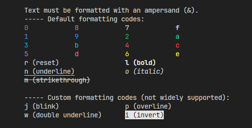

# MCFC

[](https://pypi.org/project/mcfc)
[](https://pypi.org/project/mcfc)
[](https://pypi.org/project/mcfc)
[](https://beta.ruff.rs/)

🖌 Text formatting using Minecraft color codes.

## Installation

To install MCFC, run the following command:

```
 pip install mcfc
```

## Preview



## Usage

```python
 import mcfc

 mcfc.echo("&cH&6e&el&al&bo&d!")
```

### Output


## License

`mcfc` is distributed under the terms of the [MIT](LICENSE) license.
